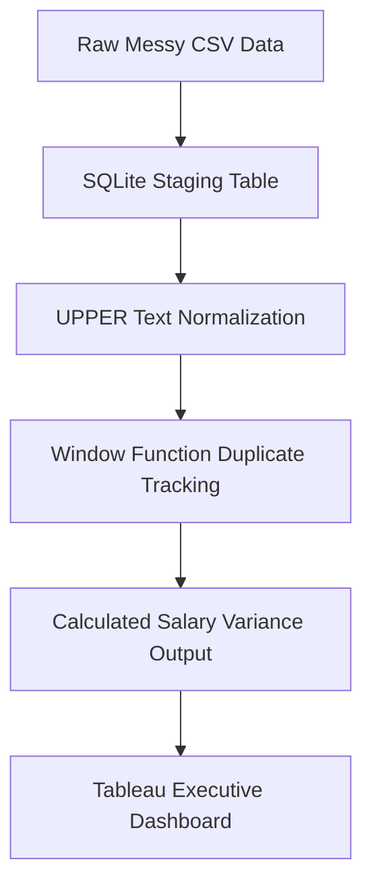

# Engineering Framework: Global Tech Compensation Analysis

## 📌 Core Engineering Problem
Corporate compensation infrastructure often suffers from fragmented data formatting and duplicate records. This analysis engineers a pipeline to standardize job classifications and compute deviations from market baselines.

## 🛠️ Data Infrastructure & Stack
*   **Engine Environment:** SQLite Engine, PostgreSQL
*   **Engineering Frameworks:** Common Table Expressions (CTEs), Partitioned Windowing Functions (`ROW_NUMBER`), Analytics Case Logic, Aggregations,Trajectory Analysis.

## 📈 Strategic Insights Discovered
1. **Classification Anomalies Detected:** Data entries contained mixed case structures and non-standard titles (e.g., `data analyst` vs `Data Analyst`). This variation skews raw metrics if not handled by explicit text manipulation tools.
2. **Compensation Imbalances:** Mid-to-Senior level engineers exhibit salary variations up to **$21,500 over average baselines**, highlighting clear opportunities to optimize regional market bands.
3. **Tiered Compensation Leaders: Utilizing DENSE_RANK(), top-earning roles within each experience level consistently isolate specialized domain tracks (e.g., Machine Learning Infrastructure and Data Engineering) over generalist roles, establishing market ceilings for each tier.
4. **Above-Market Role Benchmarking: Cross-joining role averages against the global baseline (overall_avg) reveals which specialized titles command a premium, allowing organizations to spot high-cost functions exceeding global salary baselines.
5. **Tier Distribution Across Seniority: Categorizing compensation into explicit pay bands (<$80k, $80k–$150k, >$150k) highlights the shift from mid-pay density at entry/mid levels to heavy concentration in the high-pay tier (>$150k) for senior-level roles.
6. **Senior Transition Value Spike: Pivoting experience levels (MI vs. SE) shows that transitioning from Mid to Senior yields significant percentage increases (up to ~46% in key data tracks like Data Engineer and Data Scientist), quantifying the exact economic reward of senior-level progression.

## 🗺️ Data Pipeline Architecture

