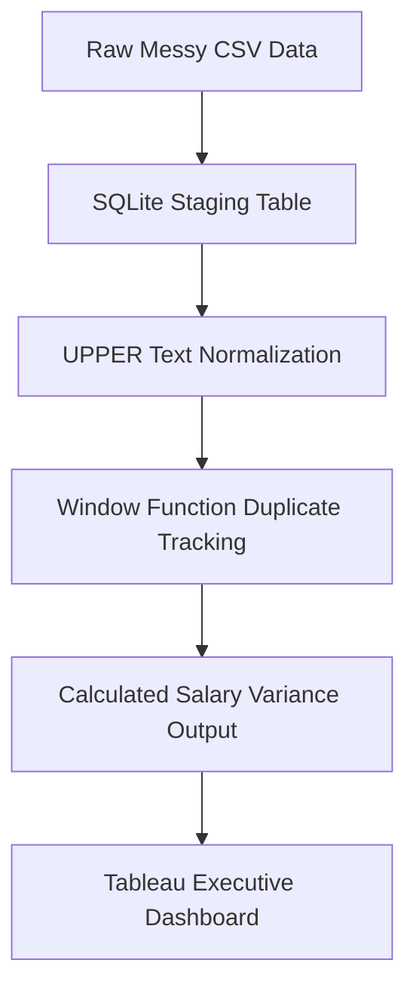

# Engineering Framework: Global Tech Compensation Analysis

## 📌 Core Engineering Problem
Corporate compensation infrastructure often suffers from fragmented data formatting and duplicate records. This analysis engineers a pipeline to standardize job classifications and compute deviations from market baselines.

## 🛠️ Data Infrastructure & Stack
*   **Engine Environment:** SQLite Engine, PostgreSQL
*   **Engineering Frameworks:** Common Table Expressions (CTEs), Partitioned Windowing Functions (`ROW_NUMBER`), Analytics Case Logic, Aggregations,Trajectory Analysis.

## 📈 Strategic Insights Discovered
1. **Classification Anomalies Detected:** Data entries contained mixed case structures and non-standard titles (e.g., `data analyst` vs `Data Analyst`). This variation skews raw metrics if not handled by explicit text manipulation tools.
2. **Compensation Imbalances:** Mid-to-Senior level engineers exhibit salary variations up to **$21,500 over average baselines**, highlighting clear opportunities to optimize regional market bands.

## 🗺️ Data Pipeline Architecture

